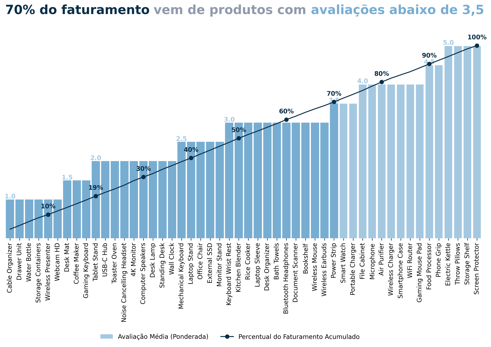
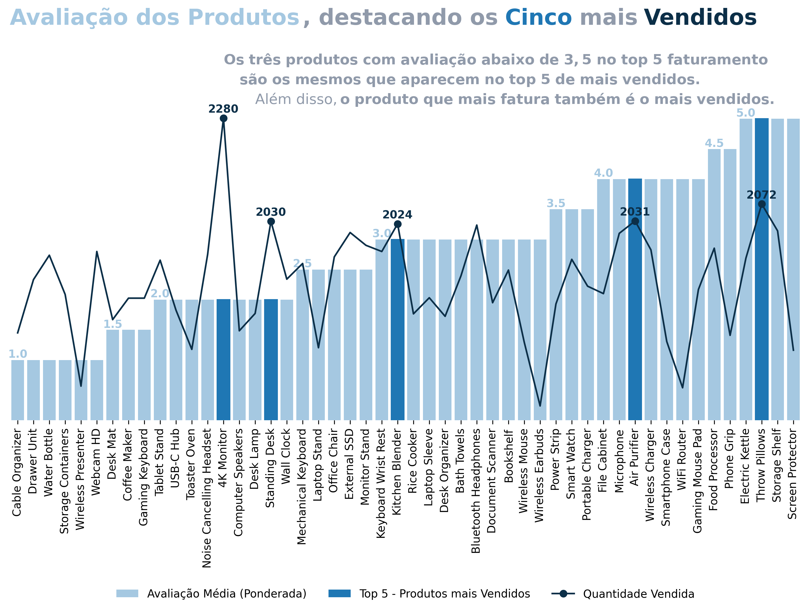
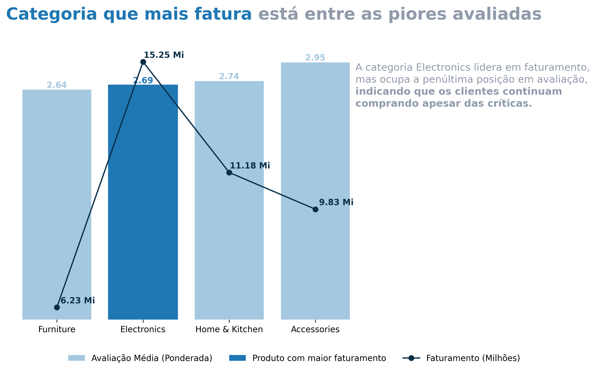

## Análise de Faturamento e Avaliação dos Produtos no E-commerce

### Objetivo da Analise

Este projeto tem como objetivo analisar a relação entre avaliações de produtos e seu desempenho em vendas em um e-commerce. Utilizando dados extraídos do Kaggle, exploramos padrões e insights sobre como a percepção dos clientes pode estar relacionada ao faturamento e à quantidade vendida.
As principais questões que buscamos responder são:
1.	Qual a distribuição percentual do faturamento por avaliação média?
2.	Os produtos que mais faturam possuem boas avaliações?
3.	Os produtos mais vendidos possuem boas avaliações?
4.	Como a avaliação média das categorias se relaciona com seu faturamento?

## Distribuição Percentual Acumulada do Faturamento por Avaliação Média
Muitas vezes, espera-se que os produtos mais bem avaliados sejam também os mais lucrativos. Para entender se essa lógica se confirma, exploramos como o faturamento total se distribui de forma acumulada ao longo das avaliações médias dos produtos.

  

Descobrimos que 70% do faturamento total vem de produtos com avaliação média de até 3,5. Isso revela um cenário em que o desempenho de vendas não está diretamente ligado à satisfação do cliente. Ou seja, muitos consumidores continuam comprando produtos com avaliações medianas ou até ruins, possivelmente influenciados por fatores como preço acessível, necessidade ou falta de opções.

### Avaliação dos Produtos com Ênfase no Faturamento
Para aprofundar a análise anterior, foi necessário observar os produtos que mais geram receita, buscando entender se esses produtos são também bem avaliados pelos consumidores.

  

Foi identificado que três dos cinco produtos que mais faturam possuem nota média abaixo de 3,5. Além disso, o produto que mais fatura tem uma nota média de apenas 2, o que reforça que boas vendas não significam necessariamente boa satisfação do cliente.

## Avaliação dos Produtos com Ênfase na Quantidade Vendida
Será que os produtos mais populares, em termos de volume de vendas, são também os mais bem avaliados? Nesta etapa, relacionamos a quantidade de vendas com as notas médias recebidas

  

O produto mais vendido também é o que mais fatura e tem uma avaliação média de apenas 2. Além disso, três dos cinco produtos com maior faturamento também estão entre os mais vendidos e possuem avaliação abaixo de 3,5. Esses dados indicam que a popularidade não está diretamente associada à qualidade percebida.

## Avaliação e Faturamento por Categoria
Expandindo a visão para categorias de produtos, buscamos entender se esse padrão de "muito lucro, pouca satisfação" também se manifesta em níveis mais amplos.

  

Os resultados mostram que a categoria Electronics, apesar de ser a que mais fatura, está em penúltimo lugar no ranking de avaliações (3ª de 4). Isso sugere que, mesmo com avaliações negativas, a demanda por eletrônicos continua alta, talvez por necessidade, tecnologia ou atratividade de preços.

## Conclusão Geral das Análises
A análise revelou inconsistências entre a percepção de qualidade dos produtos e seu desempenho comercial. Produtos e categorias mal avaliados continuam liderando em vendas, o que pode estar relacionado a:

- Necessidade do consumidor.
- Baixa concorrência.
- Estratégias de marketing e descontos.

## Futuros Passos Recomendados

1. Investigar as causas da insatisfação nos produtos mais vendidos — especialmente na categoria Electronics.
2. Analisar o impacto de campanhas de marketing e descontos sobre os produtos com avaliações baixas.
3. Monitorar a fidelização dos clientes e a taxa de recompra, cruzando com a média de avaliação dos produtos adquiridos.
---
<h3>🔗 Acesse o Projeto Completo</h3>
Clique no botão abaixo para acessar o projeto completo com todos os códigos e gráficos utilizados na análise:

<a href="https://github.com/Hiagofb/ANALISE_DESCRITIVA_ECOMERCE/blob/main/ANALISE_DESCRITIVA.ipynb" target="_blank" style="
  display: inline-block;
  padding: 10px 20px;
  background-color: #2ea44f;
  color: white;
  text-decoration: none;
  border-radius: 6px;
  font-weight: bold;
  font-family: sans-serif;
">
📊 Ver Análise Completa
</a>

---
### Tecnologias & Ferramentas Utilizadas:

<table>
  <tr>
    <td align="center"> SQL</td>
    <td align="center"> SQLAlchemy</td>
    <td align="center"> Python</td>
    <td align="center"> Pandas</td>
    <td align="center"> Matplotlib</td>
</table>
